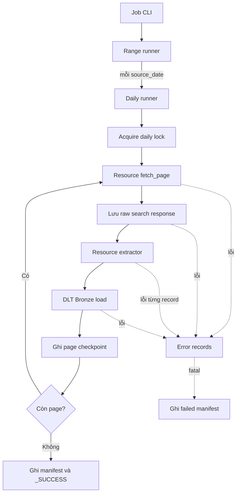

# Chuẩn luồng ingestion job

Tài liệu này mô tả vòng đời đầy đủ của một ingestion job trong Procurement
Lakehouse. KHLCNT là implementation đầu tiên; TBMT, KQLCNT và các resource sau
phải sử dụng cùng engine thay vì sao chép runner.

## 1. Mục tiêu kiến trúc

Mỗi job được chia thành ba lớp:

1. **Job entry point** nhận tham số và khởi tạo dependency.
2. **Ingestion engine** điều phối date range, phân trang, checkpoint, lưu raw,
   load Bronze và xử lý lỗi.
3. **Resource implementation** định nghĩa endpoint, query và cách chuyển dữ liệu
   của riêng resource đó thành Bronze records.

Quy tắc quan trọng:

- Engine không được chứa endpoint, tên entity hoặc field riêng của KHLCNT.
- Resource không tự triển khai checkpoint, lock, manifest hoặc vòng lặp phân trang.
- Extractor không ghi trực tiếp vào object storage hoặc khởi tạo DLT pipeline.
- Client dùng chung chỉ xử lý HTTP, authentication, SSL và retry transport.

## 2. Sơ đồ tổng thể



## 3. Cấu trúc source

```text
src/procurement/
├── jobs/
│   └── crawl_khlcnt.py
├── ingestion/
│   ├── engine/
│   │   ├── daily_runner.py
│   │   ├── dlt_resource.py
│   │   ├── metadata.py
│   │   ├── models.py
│   │   ├── pagination.py
│   │   └── stats.py
│   ├── range_runner.py
│   └── muasamcong/
│       ├── client.py
│       ├── resources/
│       │   └── khlcnt.py
│       └── extractors/
│           └── khlcnt.py
└── storage/
    ├── checkpoints.py
    ├── dlt_destination.py
    ├── error_records.py
    ├── object_store.py
    └── raw_search.py
```

## 4. Luồng thực thi chi tiết

### Bước 1: Job entry point

File `jobs/crawl_<resource>.py` là điểm bắt đầu của job. Job chịu trách nhiệm:

- Đọc CLI arguments như `start-date`, `end-date`, `page-size` và `force`.
- Kiểm tra secrets/config bắt buộc.
- Khởi tạo object-store filesystem.
- Mở source client.
- Tạo `ResourceSpec`.
- Gọi `run_daily_range()`.

Job không chứa query payload, pagination hoặc extraction logic.

Ví dụ chạy KHLCNT:

```powershell
python -m procurement.jobs.crawl_khlcnt `
  --start-date 2026-09-01 `
  --end-date 2026-09-10 `
  --page-size 50
```

Thêm `--force` nếu muốn chạy lại một ngày đã có `_SUCCESS.json`.

### Bước 2: Range runner

`ingestion/range_runner.py`:

1. Tạo một `run_id` cho toàn bộ date range.
2. Kiểm tra `start <= end`.
3. Chia range thành từng ngày.
4. Gọi daily runner một lần cho mỗi `source_date`.
5. Cộng tổng số ngày, page, search item và error.
6. Dừng và log toàn bộ run nếu một ngày phát sinh fatal error.

Một `run_id` có thể bao gồm nhiều daily partition. Checkpoint và lock vẫn được
tách theo từng resource và từng `source_date`.

### Bước 3: Resource specification

`ResourceSpec` trong `ingestion/engine/models.py` là contract giữa resource và
engine:

```python
ResourceSpec(
    identity=ResourceIdentity(source="muasamcong", resource="khlcnt"),
    pipeline_name="muasamcong_bronze",
    dataset_name="muasamcong",
    fetch_page=...,
    build_query_definition=...,
    iter_records=...,
)
```

Các hook có ý nghĩa như sau:

| Hook | Trách nhiệm |
|---|---|
| `fetch_page` | Gọi search API cho một page |
| `build_query_definition` | Tạo metadata ổn định dùng để tính fingerprint |
| `iter_records` | Fetch detail và yield Bronze records |

`query_definition` phải chứa mọi giá trị có thể làm thay đổi tập kết quả, ví dụ:

- Source và resource.
- Khoảng thời gian.
- Page size.
- Search index.
- Type filter.
- Các filter nghiệp vụ khác.

Nếu definition thay đổi, fingerprint thay đổi và engine không được resume từ
checkpoint cũ.

### Bước 4: Daily initialization

`run_daily_resource()` tạo UTC window cho một ngày:

```text
YYYY-MM-DDT00:00:00.000Z
YYYY-MM-DDT23:59:59.999Z
```

Sau đó engine:

1. Tính query fingerprint.
2. Đọc `_SUCCESS.json`.
3. Nếu đã thành công và không có `force`, kiểm tra fingerprint rồi skip ngày.
4. Nếu cần chạy, acquire daily lock.
5. Ghi manifest trạng thái `running`.
6. Khởi tạo DLT pipeline và Bronze destination.

Lock ngăn hai run khác nhau ghi đồng thời vào cùng một
`source/resource/source_date`. Lock hiện có TTL 12 giờ và được refresh sau mỗi
page thành công.

### Bước 5: Search pagination

Engine gọi `iter_search_pages()` với `spec.fetch_page`.

Mỗi response phải có cấu trúc tối thiểu:

```python
{
    "page": {
        "content": [...],
        "totalElements": 123,
        "last": False,
    }
}
```

Engine bắt đầu từ page `0`, tăng tuần tự và dừng khi `page.last` là `True`.

Nếu `totalElements >= 10_000`, engine raise `SearchResultLimitError`. Không được
coi một tập kết quả bị cắt ở giới hạn website là một daily run thành công. Khi
resource có thể vượt giới hạn này, cần thiết kế window nhỏ hơn thay vì bỏ qua lỗi.

### Bước 6: Resume từ page checkpoint

Sau khi search được một page, engine kiểm tra checkpoint của page đó:

- Có checkpoint, fingerprint khớp và không `force`: cộng lại stats rồi skip load.
- Không có checkpoint: xử lý page bình thường.
- Có checkpoint nhưng fingerprint khác: fail với
  `IncompatibleCheckpointError`.

Engine vẫn phải gọi search API cho các page đã checkpoint để đi đến page tiếp
theo; checkpoint ngăn việc fetch detail và load Bronze lặp lại.

### Bước 7: Lưu raw search response

Trước khi fetch detail, toàn bộ search response được lưu dạng JSON gzip:

```text
s3://<bucket>/_raw_search/
  <source>/<resource>/
  source_date=<YYYY-MM-DD>/
  run_id=<run_id>/
  page-<page_number>.json.gz
```

Raw search là bằng chứng đầu vào để debug hoặc replay. Nếu ghi raw thất bại,
page dừng ngay và không được load Bronze.

### Bước 8: Extraction

Engine gọi `spec.iter_records`. Extractor của resource chịu trách nhiệm:

- Đọc từng search item.
- Validate ID cần thiết.
- Fetch các detail endpoint.
- Tạo metadata chuẩn cho Bronze record.
- Yield record.
- Ghi nhận lỗi riêng lẻ vào `errors` và tiếp tục item tiếp theo nếu có thể.
- Cập nhật `PageStats` theo entity name.

Bronze record tối thiểu nên có:

```python
{
    "_source": "muasamcong",
    "_resource": "<bronze_table_name>",
    "_source_id": "...",
    "_source_version": "...",
    "_run_id": "...",
    "_source_date": "YYYY-MM-DD",
    "_ingested_at": "...",
    "_search_page": 0,
    "_content_hash": "...",
    "payload": {...},
}
```

`_resource` được DLT sử dụng làm tên bảng động. Không flatten payload tại Bronze;
giữ nguyên source payload để bảo toàn dữ liệu đầu vào.

### Bước 9: Bronze load

Engine bọc iterator bằng cấu hình DLT chung:

- `write_disposition="append"`.
- `file_format="parquet"`.
- `max_table_nesting=0`.
- Table name lấy từ `_resource` của record.

Dữ liệu được ghi theo layout:

```text
s3://<bucket>/bronze/
  <table_name>/
  source_year=<YYYY>/
  source_month=<MM>/
  source_day=<DD>/
  <load_id>.<file_id>.parquet
```

Nếu Bronze load thất bại, engine lưu error có `raw_search_uri` để page có thể
được điều tra hoặc chạy lại.

### Bước 10: Page checkpoint

Chỉ sau khi raw storage, extraction và Bronze load hoàn thành, engine mới ghi
page checkpoint:

```text
s3://<bucket>/_control/
  <source>/<resource>/
  source_date=<YYYY-MM-DD>/
  pages/page-<page_number>.json
```

Checkpoint chứa:

- Query fingerprint.
- Search item count.
- Record/error counts theo entity.
- Raw search URI.
- Error URIs.
- DLT load IDs.
- Thời điểm bắt đầu/kết thúc và duration.

Thứ tự `raw -> Bronze -> checkpoint` là bắt buộc. Không ghi checkpoint trước khi
Bronze load thành công.

### Bước 11: Daily completion

Khi hết page, engine ghi final run manifest và `_SUCCESS.json`:

```text
_control/<source>/<resource>/source_date=<date>/
├── _SUCCESS.json
├── lock.json  # chỉ tồn tại trong lúc job đang chạy
├── pages/
└── runs/run_id=<run_id>.json
```

Trạng thái cuối:

| Trạng thái | Ý nghĩa |
|---|---|
| `completed` | Hoàn thành, không có lỗi record |
| `completed_with_errors` | Bronze load thành công nhưng có detail record lỗi |
| `failed` | Có lỗi fatal ở search, raw storage hoặc Bronze load |
| `skipped` | Daily partition đã hoàn thành trước đó |

Lock được release trong `finally`, kể cả khi run thất bại.

## 5. Phân loại lỗi

Error records được lưu theo stage:

```text
s3://<bucket>/_errors/
  <source>/<resource>/
  source_date=<YYYY-MM-DD>/
  run_id=<run_id>/
  stage=<stage>/
  page-<page_number>.jsonl
```

Hai nhóm lỗi:

### Lỗi cô lập theo record

Ví dụ plan detail hoặc bid-package detail timeout. Extractor thêm error record,
tăng counter và tiếp tục item kế tiếp. Daily status trở thành
`completed_with_errors`.

### Lỗi fatal theo page/day

Ví dụ:

- Search page không lấy được sau retry.
- Vượt giới hạn search result.
- Không lưu được raw response.
- DLT Bronze load thất bại.

Engine ghi error record, ghi failed manifest và kết thúc job với exception.

## 6. Chuẩn triển khai resource mới

Ví dụ thêm TBMT.

### 6.1 Resource adapter

Tạo:

```text
ingestion/muasamcong/resources/tbmt.py
```

File này chứa:

- `TBMT_IDENTITY`.
- Search/detail endpoint constants.
- Search payload builder.
- Query definition builder.
- API adapter sử dụng `MuasamcongClient.post()`.
- `create_tbmt_spec()`.

Không đặt endpoint hoặc query TBMT vào client dùng chung.

### 6.2 Extractor

Tạo:

```text
ingestion/muasamcong/extractors/tbmt.py
```

Extractor chỉ thực hiện fetch-detail orchestration và record mapping. Dùng:

```python
stats.record("notice")
stats.error("notice_detail")
```

Không thêm field TBMT-specific vào `PageStats`.

### 6.3 Job

Tạo:

```text
jobs/crawl_tbmt.py
```

Job khởi tạo client/spec rồi gọi đúng hai runner dùng chung:

```python
run_daily_range(
    start,
    end,
    resource=spec.identity.resource,
    run_day=lambda run_id, source_date: run_daily_resource(
        fs=filesystem,
        spec=spec,
        run_id=run_id,
        source_date=source_date,
        page_size=page_size,
        force=force,
    ),
)
```

Không tạo `tbmt_runner.py` trong `muasamcong`.

### 6.4 Tests bắt buộc

Mỗi resource mới cần tối thiểu:

1. Test endpoint và search payload.
2. Test `ResourceIdentity` và `ResourceSpec`.
3. Test missing/invalid source ID.
4. Test detail timeout được ghi lỗi và item kế tiếp vẫn chạy.
5. Test parent-child extraction nếu resource có dữ liệu phân cấp.
6. Test record metadata và `_resource` table name.

Các test pagination, checkpoint, stats và range runner thuộc engine; không copy
chúng sang từng resource.

## 7. Checklist review

Trước khi merge một resource mới, xác nhận:

- [ ] Không sửa engine chỉ để thêm endpoint hoặc field nghiệp vụ.
- [ ] Không copy `run_daily_resource()` hoặc `run_daily_range()`.
- [ ] Client dùng chung không import resource module.
- [ ] Resource có namespace `source/resource` riêng.
- [ ] Query fingerprint bao phủ toàn bộ filter ảnh hưởng kết quả.
- [ ] Raw response được lưu trước Bronze load.
- [ ] Checkpoint chỉ được ghi sau Bronze load thành công.
- [ ] Lỗi record có thể cô lập thì không làm fail toàn page.
- [ ] Lỗi fatal tạo error record và failed manifest.
- [ ] Stats dùng key động, không thêm field cố định vào engine.
- [ ] Test, Ruff và compile đều thành công.

## 8. Những phần không được copy cho resource mới

Các module sau là hạ tầng dùng chung và chỉ có một implementation:

```text
ingestion/engine/*
ingestion/range_runner.py
storage/checkpoints.py
storage/error_records.py
storage/raw_search.py
storage/dlt_destination.py
```

Resource mới chỉ bổ sung `resource`, `extractor` và `job` của chính nó.
